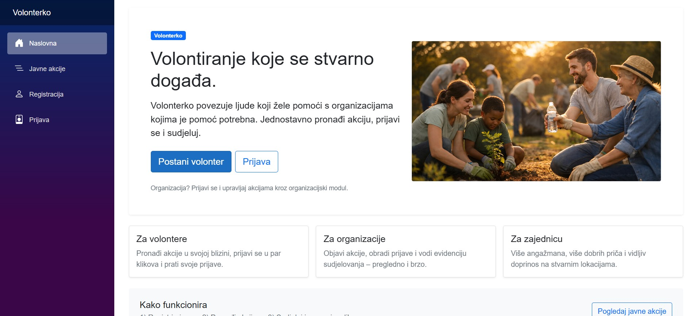
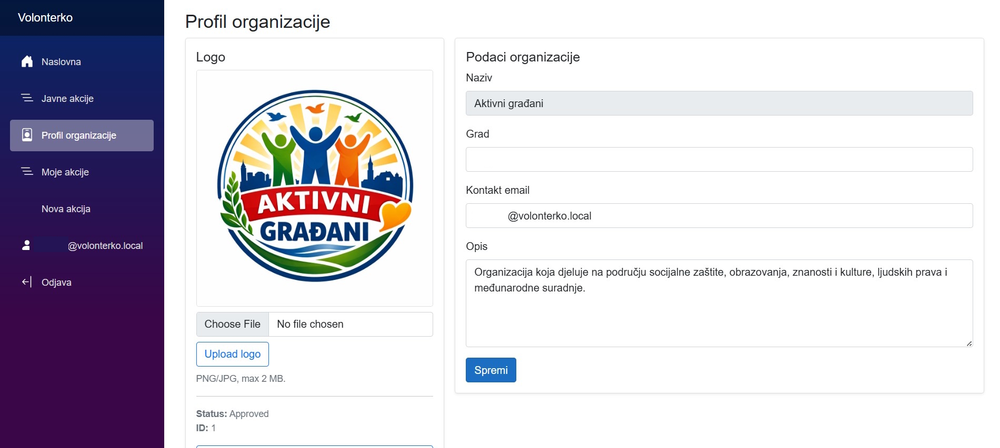
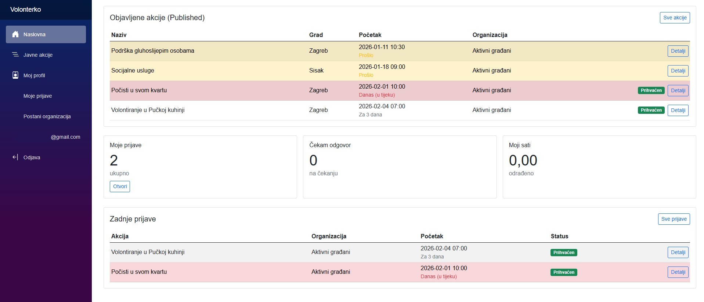
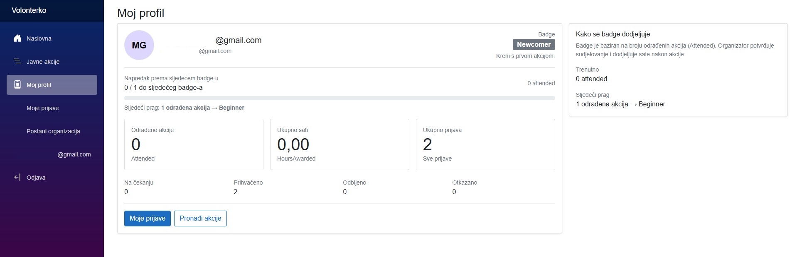

# Volonterko - Volunteering platform

## Description

Volonterko is a web application intended for the organization, management and monitoring of volunteer activities. The system connects non-profit organizations that need volunteers with individuals who want to actively participate in socially beneficial actions.

Key features include:
- Publication of volunteer actions and management of applications for non-profit organizations
- Volunteers can review available actions, register and monitor their own participation 
- System monitoring and organization approval for administrators

---

## Technologies

- ASP.NET Core Backend
- Blazor Server
- Entity Framework Core
- SQL Server
- ASP.NET Core Identity
- Bootstrap
- C#

---

## Prerequisites

Before running the application, ensure you have:

- .NET SDK 8.0 or newer
- SQL Server 2019 or newer (local or remote instance)
- Visual Studio 2022 or later

---

## Getting Started

- Clone the repository:
   ```
   git clone <repository-url>
	```
- Update the database connection string in `appsettings.json` (see in configuration)

- Apply database migrations:
   ```
   dotnet ef database update
   ```
- Run the application:
   ```
   dotnet run --project Volonterko
   ```

---

## Configuration
- Update the connection string in `appsettings.json`:
	```
	"ConnectionStrings": {
		"DefaultConnection": "Server=localhost\\SQLINSTANCE;Database=VolonterkoDb;Trusted_Connection=True;TrustServerCertificate=True;MultipleActiveResultSets=true; TrustServerCertificate=true"
		}
	```
---

## Screenshots

### Home Page


### Organization profile 


### Homepage for volunteers


### Volunteers profile info


---